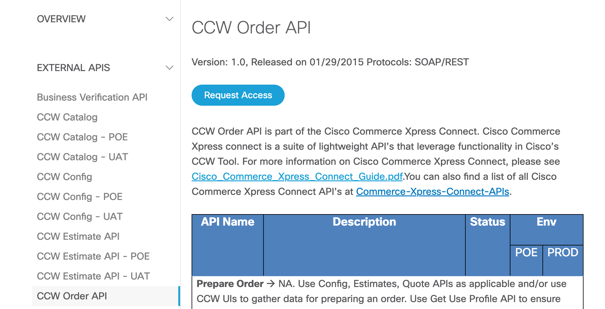
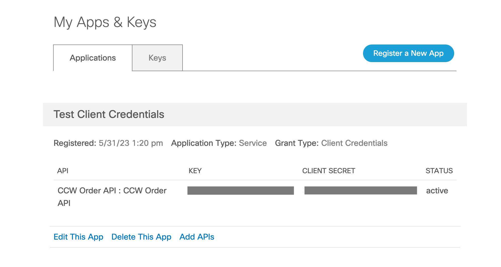
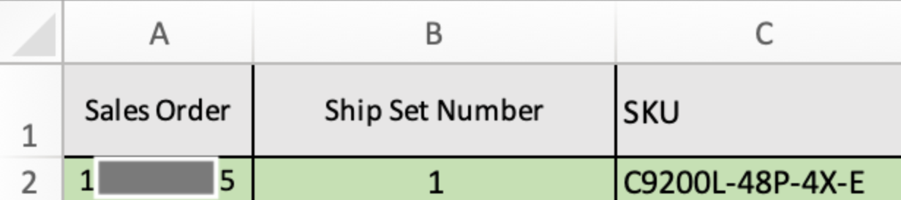
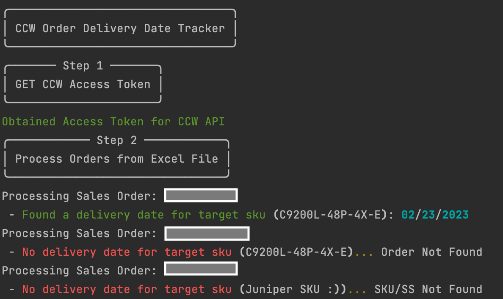

# CCW Order Tracker

This script reads an Excel file containing Cisco Sales Order Numbers, and it queries Cisco Commerce Workspace to retrieve information per order. The retrieved information is written back to the Excel File. The script can be run periodically to continually update the Excel file and track updates for the desired field.

The working example is the `Promised Delivery Date` field, but the code can be easily extended to other fields. Additional example fields are present in the `CCWOrderParser` class in `ccwparser.py`

For a full list of fields, check out the `Check Order Status` CCW API example on the [Developer Portal](https://apidocs-prod.cisco.com/).

## Contacts
* Trevor Maco

## Solution Components
* CCW API
* Excel

## Prerequisites

### CCW Order API

This application requires access to the `CCW Order API` provided at https://apiconsole.cisco.com/ and the creation of an `App`. 

A detailed guide is included [here](https://apiconsole.cisco.com/docs/read/overview/Platform_Introduction), with summarized steps bellow:

1. Sign in to API Console with CEC Credentials
2. Request Access to the CCW Order API



3. Register an `App` of `Application Type` "Service" and `Grant Type`  = "Client Credentials"
    * Note the `key` and `secret`, which are required for authentication!



**Note**: this process may change in the future, always refer to the latest documentation on the platform.

### Excel Input

This script expects an Excel file input with a minimum of:
* A column containing `Sales Order Numbers`
* A column where the `Output` will be written to (if `KEEP_HISTORY` = True, this is not necessary)

The names of the columns are specified in the `config.py` file, and other columns can be included as necessary depending on the use case.

* Promised Delivery Date Use Case:
  * Minimum Input Columns: `Sales Order`, `Delivery Date` (output -> if `KEEP_HISTORY` = True, this is not necessary)
  * Use Case Specific Columns: `SKU`, `Ship Set Number`
  



## Installation/Configuration
1. Clone this repository with `git clone [repository name]`
2. Add the App Key and App Secret to `config.py` from the prerequisites section
```python
CLIENT_KEY = ""
CLIENT_SECRET = ""
```
3. Enable `KEEP_HISTORY` feature if desired. This feature appends new date-stamped versions of `OUTPUT_COLUMN_NAME` before the `INSERT_BEFORE_COLUMN` value (Ex: Column 'F'). Columns are shifted to the right, the previous `INSERT_BEFORE_COLUMN` value becomes the most recent entry, effectively tracking progression of a column over time from left to right.
```python
KEEP_HISTORY = False
INSERT_BEFORE_COLUMN = ''
```

4. Add the essential input Excel parameters in `config.py`. Add any other columns as necessary for the use case
```python
EXCEL_FILE_NAME = ""
EXCEL_SHEET_NAME = ""
SALES_ORDER_NUMBER_COLUMN_NAME = ""
OUTPUT_COLUMN_NAME = ""
```

* Promised Delivery Date Use Case:
```python
# For Delivery Date Use Case
SHIP_SET_COLUMN_NAME = ""
SKU_COLUMN_NAME = ""
```

5. Set up a Python virtual environment. Make sure Python 3 is installed in your environment, and if not, you may download Python [here](https://www.python.org/downloads/). Once Python 3 is installed in your environment, you can activate the virtual environment with the instructions found [here](https://docs.python.org/3/tutorial/venv.html).
6. Install the requirements with `pip3 install -r requirements.txt`


## Usage

Run the script with `python ccwquery.py`

The script will parse the input file, and using the Sales Order Number, retrieve order information from CCW.

This order information is parsed using the `CCWOrderParser`, and can then be further processed for the specific use case. The results are written back to the Excel file's "output" column.

* Promised Delivery Date Use Case:




**Optional**: A cronjob can be created to periodically run `ccwquery.py`. Please consult `crontab.txt` for more information.


### LICENSE

Provided under Cisco Sample Code License, for details see [LICENSE](LICENSE.md)

### CODE_OF_CONDUCT

Our code of conduct is available [here](CODE_OF_CONDUCT.md)

### CONTRIBUTING

See our contributing guidelines [here](CONTRIBUTING.md)

#### DISCLAIMER:
<b>Please note:</b> This script is meant for demo purposes only. All tools/ scripts in this repo are released for use "AS IS" without any warranties of any kind, including, but not limited to their installation, use, or performance. Any use of these scripts and tools is at your own risk. There is no guarantee that they have been through thorough testing in a comparable environment and we are not responsible for any damage or data loss incurred with their use.
You are responsible for reviewing and testing any scripts you run thoroughly before use in any non-testing environment.