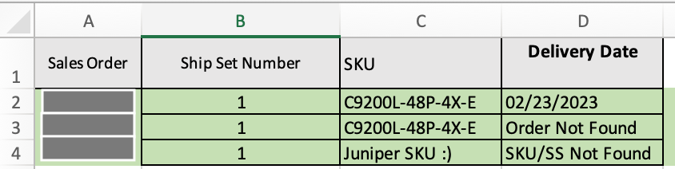

# CCW Order Tracker

This script reads an Excel file containing Cisco Order Numbers, and it queries Cisco Commerce Workspace to retrieve information about a SKU in the order. The retrieved information is written back to the Excel File. The script can be run periodically to continually update the Excel file and track updates for the desired Order SKU field(s).

Supported `Order Number Types` include:
* Sales Order Number
* Web Order Number
* Purchase Order Number

This script can track multiple fields, as well as multiple orders (either all on one Excel sheet with an `Order Column` or multiple Excel sheets where `Sheet Name = Order Number`). A field can also be tracked over time (date stamped field entries appended to the Excel Sheet).

All available fields can be found in the `CCWOrderParser` class in `ccwparser.py` as either:
* "Order Wide" Field (class attribute self.**FIELD**) - ex: self.status, track `status` field representing status of order (booked, etc.)
* "Line Item" Field (self.linelocation[i] dictionary key {**FIELD**: X} ) - ex: `deliveryDate` field representing the delivery date of a specific line item in the order

For a full list of possible fields, check out the `Check Order Status` CCW API example on the [Developer Portal](https://apidocs-prod.cisco.com/). Additional fields would need to be added appropriately to the class.

> The working example is the Promised Delivery Date for each line item in an order!

## Contacts
* Trevor Maco

## Solution Components
* CCW API
* Excel
* Pandas

## Prerequisites

### CCW Order API

This application requires access to the `CCW Order API` provided at https://apiconsole.cisco.com/ and the creation of an `App`. 

A detailed guide is included [here](https://apiconsole.cisco.com/docs/read/overview/Platform_Introduction), with summarized steps bellow:

1. Sign in to API Console with CEC Credentials
2. Request Access to the CCW Order API


3. Register an `App` of `Application Type` "Service" and `Grant Type`  = "Client Credentials"
    * Note the `key` and `secret`, which are required for authentication!


**Note**: this process may change in the future, always refer to the latest documentation on the platform.

### Excel Input

This script expects an Excel file input. At a minimum, each sheet in the Excel file should contain a column with Order `SKUs` and `Ship Set Numbers` corresponding to each SKU (prevents confusion around the same SKU in different Ship Sets).


* `Orders on One Sheet`: a column containing one of the supported `Order Number` types is required. The data **MUST** be on the first sheet!
* `Order per Sheet`: the `Sheet Name` should be the `Order Number`.

The names of the columns are specified in the `config.py` file.
  


## Installation/Configuration
1. Clone this repository with `git clone [repository name]`
2. Rename the `.env_sample` file to `.env`. Rename `src/config_sample.py` to `src/config.py`.
3. Add the App Key and App Secret to `.env` from the prerequisites section
```dotenv
CLIENT_KEY=""
CLIENT_SECRET=""
```
4. Enter the Order Number Type (`Sales Order`, `Web Order`,or `Purchase Order`) depending on which type of Order Number will be used in `src/config.py`:
```python
# Order Identification Section (Sales Order, Web Order, Purchase Order)
ORDER_ID_TYPE = "Sales Order"
```
5. Add the essential input Excel columns and file name: 
```python
# Excel Details (including mandatory Ship Set Number and SKU fields)
EXCEL_FILE_NAME = "delivery_date_example.xlsx"
SHIP_SET_COLUMN_NAME = "Ship Set Number"
SKU_COLUMN_NAME = "SKU"
```
6. If all orders are on a single sheet (sheet 1!), set the `SINGLE_SHEET` parameter to `True` (otherwise `False`) and specify the name of the column containing the `Order Numbers`:
```python
# Process multiple orders on the same sheet, or Sheet Per Order feature (if multiple orders on a single sheet,
# ORDER_COLUMN must exist!)
SINGLE_SHEET = True
ORDER_COLUMN_NAME = "Sales Order"  # Ignored if SINGLE_SHEET is False
```
7. Identify which fields to track per SKU/Order. Dictionary keys **must** map to the `CCWOrderParser` class attributes or line item dictionary keys. The values are the column names in the Excel file where the data will be written (these do not have to exist!). 
```python
# Fields to track dictionary (mapping CCW Class fields or Line Item Fields to Excel Columns Names)
FIELDS_TO_TRACK = {"deliveryDate": "Delivery Date"}
```
If no data is found for a particular field, the script will write `No Data` to the Excel file.

8. Enable `KEEP_HISTORY` feature if desired, and select the field to track. This feature appends new date-stamped versions of the field before the last inserted field value. Columns are shifted to the right and the new field value becomes the most recent entry, effectively tracking progression of a column over time from left to right.

Note: The `KEEP_HISTORY_FIELD` must be a field that is tracked in the `FIELDS_TO_TRACK` dictionary, and it must be the last field in the `FIELDS_TO_TRACK` dictionary (otherwise formatting and inserting into the Excel file breaks!)
```python
# Configurable Parameters for special field tracking over time!
KEEP_HISTORY = True
KEEP_HISTORY_FIELD = "deliveryDate"
```
9. Set up a Python virtual environment. Make sure Python 3 is installed in your environment, and if not, you may download Python [here](https://www.python.org/downloads/). Once Python 3 is installed in your environment, you can activate the virtual environment with the instructions found [here](https://docs.python.org/3/tutorial/venv.html).
10. Install the requirements with `pip3 install -r requirements.txt`


## Usage

Change directory to `src`

Run the script with `python ccwquery.py`

The script will parse the input file, and using the Order Number (either from the column or sheet name), retrieve order information from CCW.

This order information is parsed using the `CCWOrderParser`, and the results are written back to the Excel file using the `FIELDS_TO_TRACK` dictionary values for column names.

* Promised Delivery Date Use Case:




**Optional**: A cronjob can be created to periodically run `ccwquery.py`. Please consult `crontab.txt` for more information.


### LICENSE

Provided under Cisco Sample Code License, for details see [LICENSE](LICENSE.md)

### CODE_OF_CONDUCT

Our code of conduct is available [here](CODE_OF_CONDUCT.md)

### CONTRIBUTING

See our contributing guidelines [here](CONTRIBUTING.md)

#### DISCLAIMER:
<b>Please note:</b> This script is meant for demo purposes only. All tools/ scripts in this repo are released for use "AS IS" without any warranties of any kind, including, but not limited to their installation, use, or performance. Any use of these scripts and tools is at your own risk. There is no guarantee that they have been through thorough testing in a comparable environment and we are not responsible for any damage or data loss incurred with their use.
You are responsible for reviewing and testing any scripts you run thoroughly before use in any non-testing environment.